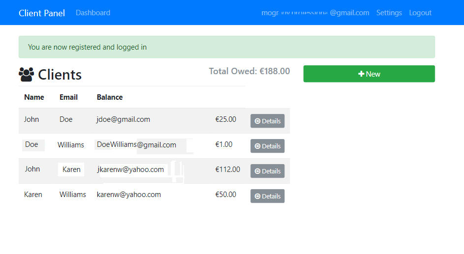
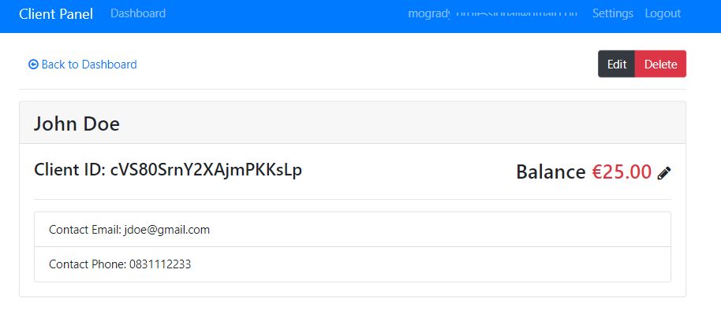
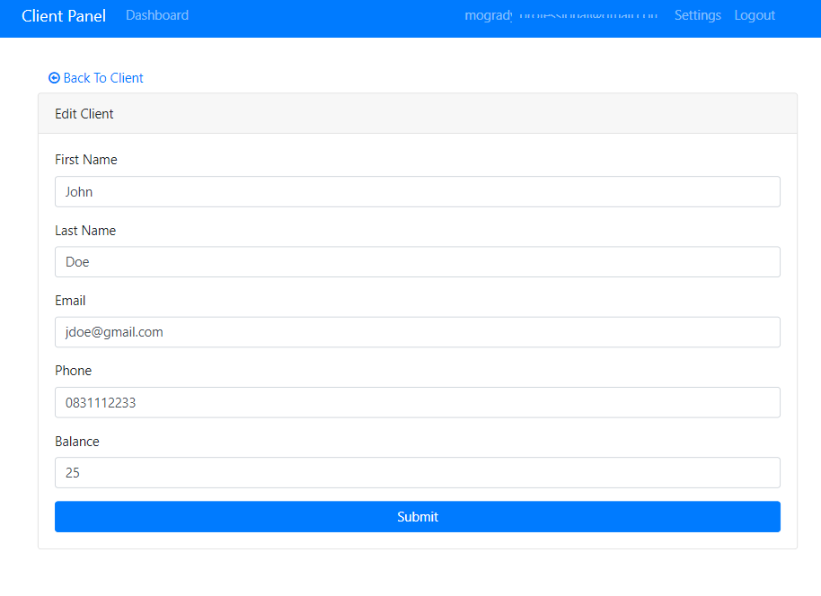
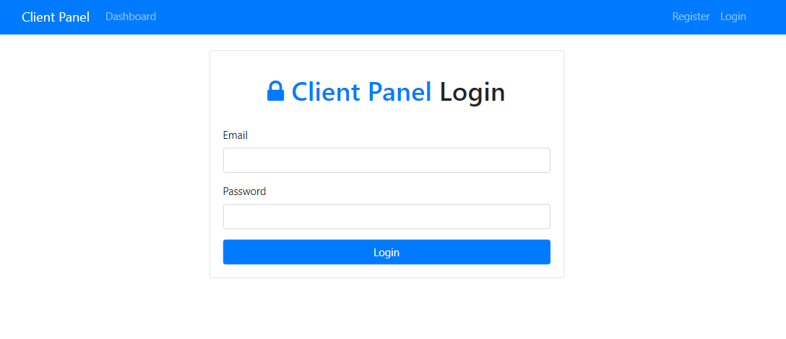
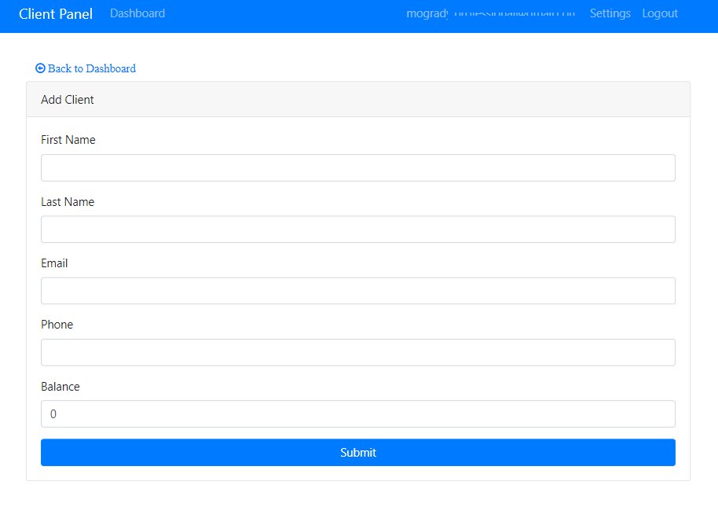
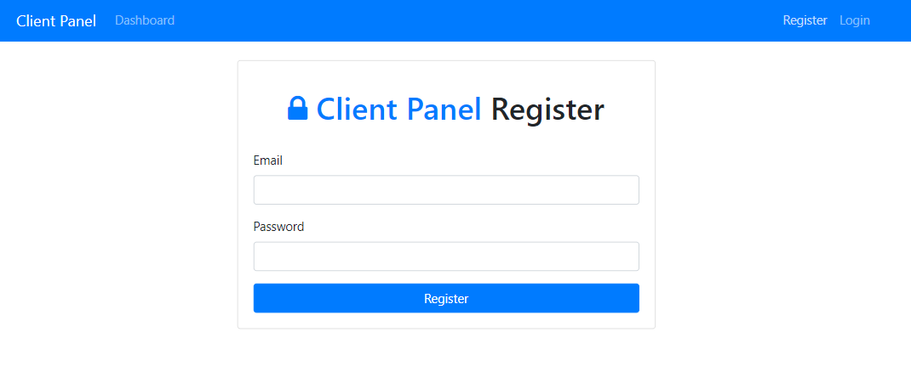
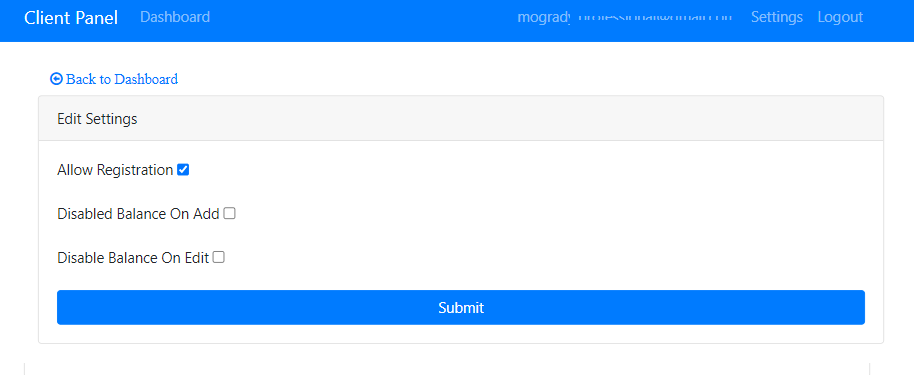

# Client Panel Angular 13

# Table of Contents

- [Client Panel Angular 13](#client-panel-angular-13)
- [Table of Contents](#table-of-contents)
- [Introduction](#introduction)
- [Functionality](#functionality)
- [Features](#features)
- [Project Images](#project-images)
  - [Dashboard](#dashboard)
  - [Details](#details)
  - [Edit Details](#edit-details)
  - [Login](#login)
  - [New](#new)
  - [Register](#register)
  - [Settings](#settings)
- [Tech](#tech)
  - [Firebase Firestore](#firebase-firestore)
- [Project Setup](#project-setup)
  - [Google Firebase](#google-firebase)
- [Getting Started - Setting up the Angular Application](#getting-started---setting-up-the-angular-application)
  - [Building the Components](#building-the-components)
  - [Include the Components in the App](#include-the-components-in-the-app)
  - [Create a new Module of Router](#create-a-new-module-of-router)
- [Installing Firebase](#installing-firebase)
  - [Create model](#create-model)

# Introduction

Client Panel application is a built on Boostrap 4 using Angular 13 with a firebase backend. It is used as a client management application and allows users to register, login and log client details and project information to help keep track of project billing.

Once logged in, a registered user can add, edit, and delete clients. The application also allows a to update client profile information and balance owed.

# Functionality

- Enable/Disable Register functionality
- Log Client and Project Details
- Register and Login
- Edit Client Details and Balance
- Firebase storage
- Firebase authentication with username & password

# Features

- Custom Auth Guard used
- Services
  - Settings Service
  - Auth Service
  - Client Service
- Models
  - Clients
  - Settings
- Firebase Deployment

# Project Images

## Dashboard

<p align="center"></p>

## Details

<p align="center"></p>

## Edit Details

<p align="center"></p>

## Login

<p align="center"></p>

## New

<p align="center"></p>

## Register

<p align="center"></p>

## Settings

<p align="center"></p>

# Tech

- [Angular 2 flash messages module](https://github.com/mythlabsuy/angular2-flash-messages)

## Firebase Firestore

- [x] snapshotChanges()

- [Firebase Collections](https://github.com/angular/angularfire/blob/master/docs/firestore/collections.md)

# Project Setup

## Google Firebase

- Created Firestore Database
- Created collection with two entries. Collection `clients`
- Firebase credentials are stored in `environment.ts` file (not included in repo)

```json
{
  "balance": 50,
  "email": "karenw@gmail.com",
  "firstName": "Karen",
  "lastName": "Williams",
  "phone": 0872224444
},
{
    "balance": 100,
    "email": "jdoe@gmail.com",
    "firstName": "John",
    "lastName": "Doe",
    "phone": 0872223334
}
```

- Authentication
  - Email and Password
  - Create initial user

```json
{
  "email": "email_goes_here@gmail.com",
  "password": "password_goes_here"
}
```

> Fireebase/firestore now set up

# Getting Started - Setting up the Angular Application

- Generate new project `ng new clientpanel`
- Install Dependencies
  - `npm i bootstrap@4.0.0-beta.2 jquery popper.js font-awesome`
- Open `package.json`
  - Remove Caret symbol `^` from the following dependencies, that way we are using the exact version of the package
    - `bootstrap`
- Add the following to `angular.json` under `styles` and `scripts`

```json
"styles": [
  "node_modules/bootstrap/dist/css/bootstrap.min.css",
  "node_modules/font-awesome/css/font-awesome.min.css",
  "src/styles.css"
],
"scripts": [
  "node_modules/jquery/dist/jquery.min.js",
  "node_modules/popper.js/dist/umd/popper.min.js",
  "node_modules/bootstrap/dist/js/bootstrap.min.js"
]
```

## Building the Components

- `ng g c components/navbar --skipTests=true --module=app.module.ts`
- `ng g c components/clients --skipTests=true --module=app.module.ts`
- `ng g c components/sidebar --skipTests=true --module=app.module.ts`
- `ng g c components/add-client --skipTests=true --module=app.module.ts`
- `ng g c components/edit-client --skipTests=true --module=app.module.ts`
- `ng g c components/client-details --skipTests=true --module=app.module.ts`
- `ng g c components/login --skipTests=true --module=app.module.ts`
- `ng g c components/register --skipTests=true --module=app.module.ts`
- `ng g c components/dashboard --skipTests=true --module=app.module.ts`
- `ng g c components/settings --skipTests=true --module=app.module.ts`
- `ng g c components/not-found --skipTests=true --module=app.module.ts`

## Include the Components in the App

- In `app.component.html` add the following

```html
<app-navbar></app-navbar>
```

- In `navbar.component.html` add the navbar from bootstrap.

## Create a new Module of Router

`ng g m app-routing --flat --module=app.module.ts `

> Bring in all modules you want to add to the route
> `app-routing.module.ts`

```typescript
import { NgModule } from "@angular/core";
import { RouterModule, Routes } from "@angular/router";
import { DashboardComponent } from "./components/dashboard/dashboard.component";
import { LoginComponent } from "./components/login/login.component";
import { RegisterComponent } from "./components/register/register.component";
import { AddClientComponent } from "./components/add-client/add-client.component";
import { EditClientComponent } from "./components/edit-client/edit-client.component";
import { ClientDetailsComponent } from "./components/client-details/client-details.component";
import { SettingsComponent } from "./components/settings/settings.component";
import { NotFoundComponent } from "./components/not-found/not-found.component";

// Create Routes
const routes: Routes = [
  { path: "", component: DashboardComponent },
  { path: "login", component: LoginComponent },
  { path: "register", component: RegisterComponent },
  { path: "client/add", component: AddClientComponent },
  { path: "client/edit/:id", component: EditClientComponent },
  { path: "client/:id", component: ClientDetailsComponent },
  { path: "settings", component: SettingsComponent },
  { path: "**", component: NotFoundComponent },
];

@NgModule({
  imports: [RouterModule.forRoot(routes)],
  exports: [RouterModule],
})
export class AppRoutingModule {}
```

- Bring in the links in the navbar

```html
<nav class="navbar navbar-expand-md navbar-dark bg-primary mb-4">
  <div class="container">
    <a routerLink="/" class="navbar-brand">Client Panel</a>
    <button
      class="navbar-toggler"
      type="button"
      data-toggle="collapse"
      data-target="#navbarMain"
    >
      <span class="navbar-toggler-icon"></span>
    </button>
    <div class="collapse navbar-collapse" id="navbarMain">
      <ul class="navbar-nav mr-auto">
        <li class="nav-item">
          <a routerLink="/" class="nav-link">Dashboard</a>
        </li>
      </ul>

      <ul class="navbar-nav ml-auto">
        <li class="nav-item">
          <a routerLink="/register" class="nav-link">Register</a>
        </li>
        <li class="nav-item">
          <a routerLink="/login" class="nav-link">Login</a>
        </li>
      </ul>
    </div>
  </div>
</nav>
```

- Bring in router-outlet in the app.component.html

```html
<app-navbar></app-navbar>
<div class="container">
  <router-outlet></router-outlet>
</div>
```

> Routing Module Setup Complete

# Installing Firebase

- `npm i firebase angularfire2`
- From within google console, create a new project and get the config object and add it to the `environment.ts` file
- Also add the code to the `environment.prod.ts` file

> Normally you have a seperate project for development and production.

```typescript
export const environment = {
  production: false,
  firebase: {
    apiKey: " ",
    authDomain: " ",
    projectId: " ",
    storageBucket: " ",
    messagingSenderId: " ",
    appId: "",
  },
};
```

- Import the `environment ` object from `src/environments/environment` into the `app.module.ts` file and the following below to get started

```typescript
import { AngularFireModule } from "@angular/fire/compat";
import { AngularFireAuth } from "@angular/fire/compat/auth";
```

- Running into issues with packages for firebase

## Create model

- Create file called `Clients.ts` inside folder called `models` in the `src/app` folder

```ts
export interface Client {
  id?: string;
  firstName?: string;
  lastName?: string;
  email?: string;
  phone?: string;
  balance?: number;
}
```
